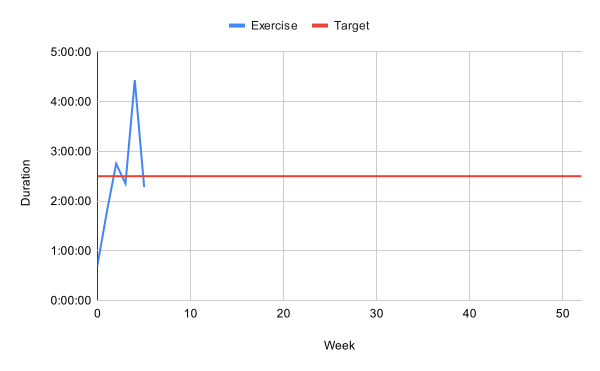
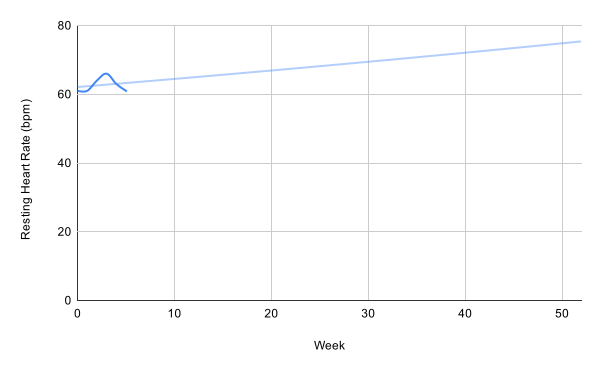

---
date:
  created: 2024-08-29
  updated: 2024-10-13
authors:
  - mash
categories:
  - Health
tags:
  - Fitness
  - Weight loss
---

# Fitness progress

Tracking my ongoing progress towards my health and fitness goals.

<!-- more -->

See my [original post](fitness-journey.md) for what I'm trying to achieve and how I'm doing it.

## Weight

??? abstract "Data"

    | Date     | Weight (kg) | Difference (kg) | Total (kg) |
    | -------- | ----------- | --------------- | ---------- |
    | 29/08/24 | 94.4        |                 |            |
    | 05/09/24 | 93.8        | -0.6            | -0.6       |
    | 12/09/24 | 93.1        | -0.7            | -1.3       |
    | 22/09/24 | 91.9        | -1.2            | -2.5       |
    | 29/09/24 | 90.4        | -1.5            | -4.0       |
    | 06/10/24 | 89.1        | -1.3            | -5.3       |
    | 13/10/24 | 89.3        | +0.2            | -5.1       |

## Composition

??? abstract "Data"

    | Date     | Body fat | Lean mass (kg) | Fat mass (kg) |
    | -------- | -------- | -------------- | ------------- |
    | 29/08/24 | 38.3%    | 58.2           | 36.2          |
    | 05/09/24 | 37.8%    | 58.3           | 35.5          |
    | 12/09/24 | 37.3%    | 58.4           | 34.7          |
    | 22/09/24 | 36.6%    | 58.3           | 33.6          |
    | 29/09/24 | 35.5%    | 58.3           | 32.1          |
    | 06/10/24 | 34.3%    | 58.5           | 30.6          |
    | 13/10/24 | 34.6%    | 58.4           | 30.9          |

## BMI

??? abstract "Data"

    | Date     | BMI  |
    | -------- | ---- |
    | 29/08/24 | 31.9 |
    | 05/09/24 | 31.7 |
    | 12/09/24 | 31.5 |
    | 22/09/24 | 31.1 |
    | 29/09/24 | 30.6 |
    | 06/10/24 | 30.1 |
    | 13/10/24 | 30.2 |

## Exercise

??? abstract "Data"

    | Week | Duration |
    | ---- | -------- |
    | 0    | 0:43:00  |
    | 1    | 1:47:00  |
    | 2    | 2:45:00  |
    | 3    | 2:21:00  |
    | 4    | 4:26:00  |
    | 5    | 2:18:00  |
    | 6    | 4:05:00  |

## Resting heart rate

??? abstract "Data"

    | Week | Resting heart rate |
    | ---- | ------------------ |
    | 0    | 61                 |
    | 1    | 61                 |
    | 2    | 64                 |
    | 3    | 66                 |
    | 4    | 63                 |
    | 5    | 61                 |
    | 6    | 61                 |

## Goals

### Projected

| Goal | Weight (kg) | Best case | Worst case |
| ---- | ----------- | --------- | ---------- |
| 2nd  | 85.2        | 17/11/24  | 29/12/24   |
| 3rd  | 80.9        | 22/12/24  | 09/03/25   |
| 4th  | 76.9        | 19/01/25  | 18/05/25   |
| 5th  | 73.0        | 23/02/25  | 27/07/25   |
| 6th  | 69.4        | 23/03/25  | 28/09/25   |

### Completed

| Goal | Weight (kg) | Achieved |
| ---- | ----------- | -------- |
| 1st  | 89.7        | 06/10/24 |
